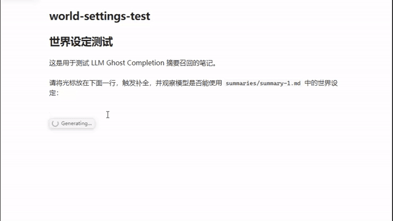

# Ghostwriter LLM for Obsidian

GitHub Copilot-style inline writing completion for Obsidian, powered by an OpenAI-compatible chat-completions API.

## Features

- Inline ghost-text completion at the cursor.
- Streaming responses with optional thinking preview.
- Preview mode for reviewing a completion before insertion.
- Configurable prompt templates, message roles, and completion context.
- OpenAI-compatible providers, including local servers such as llama.cpp.
- Separate, manually generated note summaries stored as `summary-{number}.md` files.
- Prompt cache hit-rate reporting for providers such as DeepSeek.
- Configurable accept and dismiss shortcuts.

## Quick Start

1. Build the plugin with `npm install` followed by `npm run build`.
2. The build publishes `main.js`, `styles.css`, and `manifest.json` to the configured local test vault.
3. In Obsidian, open the plugin settings and configure the API base URL, API key, and model.
4. Run the command `Trigger LLM completion at cursor`.
5. Accept the suggestion with `Shift+Insert` or dismiss it with `Escape`.

The default publish directory is:

```text
test/test/.obsidian/plugins/ghostwriter-llm/
```

To publish to another local directory, set `OBSIDIAN_PLUGIN_DEST` before running `npm run publish`.

## Summaries

Summaries are never written into the source note. The `Generate summary for current note` command creates or updates a separate file in the configured summary folder, which defaults to `summaries/`.

Each generated file uses this format:

```markdown
---
source: "path/to/note.md"
---

The manually generated summary text.
```

Summary generation is manual. Summary injection can be enabled or disabled globally in settings, or temporarily with the `Summary: ON/OFF` status-bar item or the `Toggle summary injection (session)` command. The `Note summary: ON/OFF` status-bar item and `Toggle current note summary injection` command persistently exclude or include the active note's summary without affecting other summaries.

The bottom status bar shows `Cache: ...` after each completion, and preview mode shows the full prompt-cache usage. DeepSeek automatically caches matching prompt prefixes server-side and reports `prompt_cache_hit_tokens` and `prompt_cache_miss_tokens`; the plugin calculates the hit rate from those response fields. Providers that do not report these fields show `N/A`.

## Settings Groups

- **Prompt management**: restore, export, and import prompt bundles.
- **Connection & model**: API endpoint, model, token limit, word limit, and temperature.
- **Prompt & context**: system prompt, prompt template, and cursor context size.
- **Summary recall**: summary folder, summary model, and summary generation limits.
- **Reasoning**: optional chain-of-thought instructions and triggers.
- **Display & shortcuts**: preview mode, streaming, thinking preview, and keyboard shortcuts.

## Demo



## Development

```bash
npm install
npm run build
npm run dev
```

`npm run build` runs the TypeScript check, creates a production bundle, and publishes the plugin files to the local test vault. `npm run dev` starts the esbuild watch process.

## License

MIT
